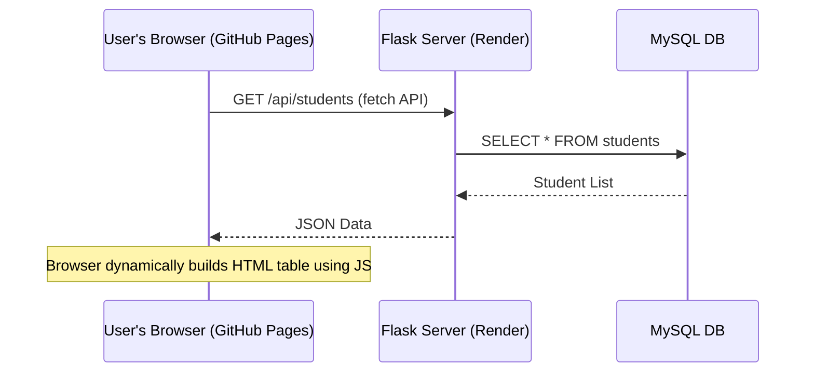

# Deployment Guide: Student Task Manager

This document provides step-by-step instructions to deploy the **Student Task Manager** application. It details how to host the dynamic Flask & MySQL application on **Render**, and explains the architectural limitations and workarounds regarding **GitHub Pages**.

---

## 1. Architectural Overview & Hosting Choices

Before deploying, it is crucial to understand how the application's components work and where they can be hosted:

```mermaid
graph TD
    User([User's Browser]) -->|HTTP Requests| WebHost[Web Hosting Service]
    WebHost -->|Flask App logic| DB[Database Server]
    
    subgraph Render (Dynamic Hosting)
        WebHost1[Flask Application on Render] -->|MySQL Connector| DB1[External MySQL DB / Render Disk MySQL]
    end
    
    subgraph GitHub Pages (Static Hosting)
        WebHost2[Static HTML / CSS / JS] -.->|Cannot run Python / MySQL| NoRun[X Invalid for full app]
    end
```

### Render vs. GitHub Pages

| Hosting Platform | Type of Content | Compatible with current app? | Cost |
| :--- | :--- | :--- | :--- |
| **Render** | **Dynamic** (Python, Flask, databases, Docker, etc.) | **Yes (Recommended)**. Render runs Python backend processes and supports connections to databases. | Free tier available (Web Services spin down after inactivity). |
| **GitHub Pages** | **Static** (HTML, CSS, JS, Images) | **No (Not directly)**. GitHub Pages cannot run Python code or host databases. It only serves static assets. | Free. |

---

## 2. Deploying the Application on Render

Render is the ideal platform for deploying this Flask application. To do so successfully, you must make a few adjustments to make the code production-ready.

### Step 2.1: Make the Code Production-Ready

Currently, the database credentials and Flask secret key are hardcoded, which is a security risk and prevents the application from connecting to production databases on Render.

#### A. Modify `db_config.py` to use Environment Variables
Update `db_config.py` to read database configuration from environment variables. This allows Render to inject the credentials securely.

```python
import os
import mysql.connector

def get_database_connection():
    # Read environment variables, falling back to local credentials for local development
    connection = mysql.connector.connect(
        host = os.environ.get('DB_HOST', 'localhost'),
        user = os.environ.get('DB_USER', 'root'),
        password = os.environ.get('DB_PASSWORD', 'Akash@1234'),
        database = os.environ.get('DB_NAME', 'student_task_manager'),
        port = int(os.environ.get('DB_PORT', 3306))
    )
    return connection
```

#### B. Modify `app.py` for Secret Key
Update the Flask secret key in `app.py` to load from an environment variable:

```python
app.secret_key = os.environ.get("SECRET_KEY", "secret123")  # Fallback to local default
```

---

### Step 2.2: Setup a Production MySQL Database

Render's free tier includes PostgreSQL database hosting, but not MySQL. To host your MySQL database, choose one of these options:

#### Option A: External Managed MySQL Database (Recommended & Easiest)
Create a free-tier MySQL instance on a database-as-a-service provider:
1. **Aiven** (aiven.io) or **Clever Cloud** (clever-cloud.com) offer free-tier MySQL databases.
2. Sign up and create a MySQL database.
3. Import your tables and initial data (using the DDL schema SQL files).
4. Save the Host, Database Name, User, Password, and Port details.

#### Option B: Deploy MySQL on Render via Docker
If you want everything on Render, you can deploy a MySQL service using Render's Docker runtime:
1. Create a new **Private Service** on Render.
2. Choose **Docker** as the environment.
3. Use a public MySQL image (e.g., `mysql:8.0`).
4. Attach a persistent disk to the service to prevent data loss.
5. Set environment variables like `MYSQL_ROOT_PASSWORD`, `MYSQL_DATABASE`, `MYSQL_USER`, `MYSQL_PASSWORD`.

---

### Step 2.3: Configure the Web Service on Render

Once your database is set up and your code is pushed to a GitHub repository:

1. Log in to [Render Dashboard](https://dashboard.render.com).
2. Click **New +** and select **Web Service**.
3. Connect your GitHub repository.
4. Configure the service details:
   - **Name**: `student-task-manager`
   - **Region**: Choose the one closest to you (or your database).
   - **Branch**: `main` (or your default branch)
   - **Runtime**: `Python`
   - **Build Command**: `pip install -r requirements.txt`
   - **Start Command**: `gunicorn app:app` (Render will also auto-detect this from your `Procfile`)
5. Click **Advanced** to add the following **Environment Variables**:
   - `DB_HOST`: Your production MySQL host (e.g., from Aiven/Clever Cloud).
   - `DB_USER`: Your production MySQL user.
   - `DB_PASSWORD`: Your production MySQL password.
   - `DB_NAME`: Your production MySQL database name.
   - `DB_PORT`: `3306` (or appropriate port).
   - `SECRET_KEY`: A long, random string for Flask sessions.
6. Click **Create Web Service**. Render will build the environment and start the application.

---

## 3. Deploying / Hosting with GitHub Pages

Since GitHub Pages only serves static files (HTML, CSS, JavaScript, and assets), a direct deployment of this Flask & MySQL application is not possible. However, depending on your goals, there are two workarounds:

### Workaround A: Decoupled SPA Architecture (Best Practice)
If you want to use GitHub Pages for hosting, you must decouple the frontend from the backend:

1. **Backend on Render (API)**:
   - Modify your Flask application to serve JSON data (REST API endpoints) instead of rendering Jinja templates.
   - For example, `@app.route('/api/students')` returns `jsonify(student_list)`.
2. **Frontend on GitHub Pages (Static)**:
   - Create a static client-side application (HTML, CSS, JavaScript) that fetches data from the Flask API on Render using `fetch()` or `Axios`.
   - Host this static folder on GitHub Pages.
   - *Note*: Ensure you configure **CORS** (`flask-cors`) on your Flask backend so the GitHub Pages frontend is allowed to make API calls to the Render backend.



#### Steps to Deploy Decoupled Frontend to GitHub Pages:
1. Put your static frontend files in a folder (e.g., `dist` or the root of your repo).
2. Push the code to GitHub.
3. In your GitHub Repository, go to **Settings** > **Pages** (under the Code and automation section).
4. Under **Build and deployment**, set the source to **Deploy from a branch**.
5. Select your branch (e.g., `main`) and folder (e.g., `/root` or `/docs`), and click **Save**.
6. GitHub will publish your site to `https://<your-username>.github.io/<repository-name>/`.

---

### Workaround B: Static Site Generation (SSG)
If the application does not need dynamic write/update capabilities (e.g., you just want to publish a read-only dashboard portfolio), you can generate a static snapshot of your templates:

1. Run the Flask application locally.
2. Use a crawler tool or a python library (like `Frozen-Flask`) to freeze all Flask endpoints into static HTML files.
3. Commit these compiled HTML files to a separate branch or `/docs` folder and deploy that directory to GitHub Pages.
